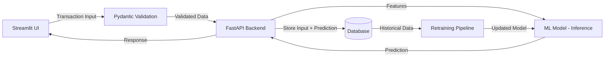

# 🛡️ Fraud Detection System — End-to-End ML Pipeline

[](https://www.python.org/)
[](https://fastapi.tiangolo.com/)
[](https://streamlit.io/)
[](https://www.docker.com/)
[](LICENSE)


A production-style **fraud detection system** that goes beyond a Jupyter notebook — it covers the full lifecycle of a real ML product: data ingestion, EDA, feature engineering, handling severe class imbalance, model training, validation, deployment behind a REST API, a user-facing UI, and a **feedback loop that logs every prediction back to a database for retraining**.

Built to mirror how fraud detection actually works in production, not just how it works in a demo.

---

## 🎯 Why This Project

Most fraud-detection portfolios stop at "trained a model, got 95% accuracy." This one is built as a deployable system:

- **Severely imbalanced data** (fraud is rare) handled with two complementary strategies — SMOTE and class-weighting — compared head-to-head rather than assumed.
- **A real database layer**, not a flat CSV — including the integration issues that come with connecting a live app to a persistent store.
- **A validation boundary** (Pydantic) between the UI and the model, so bad or malformed input never reaches inference.
- **A retraining loop** — every prediction and its input is persisted, so the model can be retrained on real production data over time, not just the original static dataset.
- **Fully containerized** and cloud-deployment-ready, not just "runs on my machine."

---

## 🏗️ Architecture



**Flow:**
1. User submits transaction details through the **Streamlit** GUI.
2. Input is validated against a **Pydantic** schema (type safety, range checks, required fields) before it ever reaches the model.
3. **FastAPI** routes the validated request to the trained model for inference.
4. The prediction — along with the original input — is written to the **database**.
5. This logged data becomes the foundation for **periodic retraining**, so the model keeps learning from real usage instead of staying frozen at training time.
6. The entire stack is **Dockerized** for consistent, reproducible deployment.

---

## ✨ Key Features

| Area | What Was Built |
|---|---|
| **Data & EDA** | Full exploratory analysis and visualization to understand fraud patterns and feature distributions |
| **Feature Engineering** | Custom feature transformations to improve model discriminative power |
| **Imbalance Handling** | Compared **SMOTE (oversampling)** vs **class-weighted models** to handle a highly skewed fraud/non-fraud ratio |
| **Model Training** | Multiple algorithms trained and evaluated under both imbalance-handling strategies |
| **API Layer** | **FastAPI** backend exposing prediction endpoints |
| **Input Validation** | **Pydantic** models enforce a strict, typed contract between UI and backend |
| **Persistence** | Every prediction + input is saved to a database, enabling **traceability and retraining** |
| **UI** | **Streamlit** interface for real-time, human-friendly transaction submission |
| **Deployment** | **Dockerized**, cloud-deployment ready |

---

## 🧰 Tech Stack

- **Language:** Python 3.10+
- **Modeling:** scikit-learn, imbalanced-learn (SMOTE)
- **API:** FastAPI, Uvicorn
- **Validation:** Pydantic
- **UI:** Streamlit
- **Database:** [PostgreSQL / MySQL / SQLite — update with your actual DB]
- **Containerization:** Docker, Docker Compose
- **Data & Viz:** Pandas, NumPy, Matplotlib/Seaborn


---

## ⚙️ Handling Class Imbalance

Fraud detection is a textbook extreme class-imbalance problem — fraudulent transactions are a tiny fraction of total volume. Two strategies were implemented and compared rather than picking one blindly:

1. **SMOTE (Synthetic Minority Oversampling)** — generates synthetic examples of the minority (fraud) class to balance the training distribution.
2. **Class Weighting** — penalizes misclassification of the minority class more heavily during training, without altering the dataset itself.

Both approaches were evaluated using metrics appropriate for imbalanced problems (Precision, Recall, F1-score, ROC-AUC / PR-AUC — **not raw accuracy**, which is misleading on skewed data).


---

## 🚧 Engineering Challenges & Solutions

Real challenges solved during the build (this section is what separates this from a tutorial project):

- **Database Integration** — Connecting a live FastAPI service to a persistent database for prediction logging required handling connection pooling, schema design for storing variable input + prediction pairs, and reliable read/write cycles for the retraining loop.
- **Validation Boundary** — Introduced Pydantic schemas so malformed or malicious input from the UI is rejected before it reaches the model, keeping inference logic clean and safe.
- **Imbalanced Data** — Naively training on the raw distribution produced a model that looked accurate but missed most actual fraud; solved by testing SMOTE and class-weighting side by side and evaluating with imbalance-aware metrics.
- **Retraining Loop** — Designed the database schema so every served prediction becomes a labeled (or label-able) training example for future retraining, closing the loop between deployment and model improvement.

---

## 🚀 Getting Started

### Prerequisites
- Docker & Docker Compose installed
- (Optional) Python 3.10+ if running components outside Docker

### Run with Docker
```bash
git clone https://github.com/<your-username>/fraud-detection-system.git
cd fraud-detection-system
docker-compose up --build
```

- **Streamlit UI:** http://localhost:8501
- **FastAPI docs (Swagger):** http://localhost:8000/docs

### Run Locally (without Docker)
```bash
pip install -r requirements.txt

# Start the API
uvicorn src.api.main:app --reload

# Start the UI (in a separate terminal)
streamlit run src/ui/app.py
```

---

## 🔌 API Usage

**Endpoint:** `POST /predict`

```json
{
  "transaction_amount": 1500.00,
  "transaction_type": "online",
  "account_age_days": 45,
  "...": "..."
}
```

**Response:**
```json
{
  "prediction": "fraud",
  "fraud_probability": 0.87,
  "prediction_id": "uuid-here"
}
```

*(Update field names to match your actual Pydantic schema.)*

---

## 🔁 Retraining Pipeline

Every prediction is persisted with its input features, enabling:
- Drift monitoring — comparing live input distributions to training data over time
- Periodic retraining on accumulated real-world data
- A feedback loop once ground-truth labels (confirmed fraud/not-fraud) become available

*(If you've automated this — e.g. a scheduled retraining job — describe it here; it's a strong signal of production-mindedness.)*

---

## 📈 Future Improvements

- [ ] Automated retraining trigger based on data drift detection
- [ ] Model monitoring dashboard (prediction distribution, latency, drift)
- [ ] CI/CD pipeline for automated testing and deployment
- [ ] A/B testing between model versions in production

---

## 📬 Contact

**[Your Name]**
[LinkedIn] · [GitHub] · [Email]

---

*If you found this project interesting, feel free to star ⭐ the repo or reach out — always happy to discuss the design decisions behind it.*